# Korzo Food - Fast Food Web Aplikacija

## Kratki opis teme
Korzo Food je moderna web aplikacija za pregled hrane razvijena za lokalni fast food. Omogućava korisnicima pregled jela, slanje poruka preko kontakt forme, dok administratori mogu upravljati ponudom i provjeravati sugestije, pitanja i eventualne narudzbe.

---

## Tehnologije korištene u radu

- React.js
- CSS3 (sa Poppins fontom i custom dizajnom)
- JSON Server (mock backend)
- JavaScript (ES6+)
- Google Maps Embed API

---

## Struktura projekta

```
Korzo-Food/
├── public/
│   └── images/              # slike jela, logo itd.
├── src/
│   ├── components/          # Navbar, Footer, Hero, Card, itd.
│   ├── pages/               # Home, About, Contact, Admin, Login, Register
│   ├── styles/              # svi CSS fajlovi
│   ├── data/                # fajl sa podacima o jelima (ako postoji)
│   └── App.js               # glavna komponenta
├── db.json                  # baza podataka za JSON Server
└── README.md                # dokumentacija
```

---

## Funkcionalnosti i opis dizajna

- **Početna stranica** sa promotivnim heroom, prikazom jela po kategorijama
- **Navigacija** sa hamburger menijem i linkovima za sve sekcije
- **Autentikacija** (Prijava, Registracija)
  - Dvije uloge: `admin`, `guest`
- **Admin Panel** – dodavanje jela
- **Kontakt forma** – validacija email adrese, prikaz poruka za admina
- **Responsive dizajn** za mobitel, tablet i desktop
- **Dizajn**: crveno-bijela paleta, `#ff3c38`, `#ff5e57`
- **Font**: Poppins (Google Fonts)

---

## Uloge korisnika

- **Admin**
  - Može dodavati jela
  - Ima pristup listi svih poruka korisnika
- **Guest**
  - Može pregledati jela
  - Može poslati poruku
- **Neregistrovani korisnik**
  - Može pregledati sadržaj
  - Može poslati poruku ali ce biti prikazano default ime

## Doprinos članova tima

- **Eldar Deronja (vođa tima)** – 
- **Amna Bečak** – 
- **Naida Burkić** – 

### Naida
- Implementirala autentikaciju (login/registracija) koristeći `json-server` i kreirala testne korisnike
- Doradila izgled stranica, dodala pozadine i ispravila greške u prikazu
- Unijela brojne proizvode (jela) u bazu i frontend prikaz

### Amna
- Kreirala stranice: **O nama**, **Kontakt**, **Prijava** i **Registracija**
- Implementirala **admin panel** s prikazom samo za admin korisnike i zaštitila rutu
- Omogućila dodavanje jela u admin panel (kategorije, slike)
- Ažurirala početnu stranicu s **hero sekcijom** i grupisanim prikazom jela
- Dodala dugme **„Dodaj u korpu“** za svako jelo i doradila validaciju e-maila

### Eldar (vođa grupe)
- Postavio strukturu React projekta i inicijalne fajlove
- Razvio formu za dodavanje jela u admin panel koristeći slike iz lokalnog `public/images` foldera
- Implementirao pozadinsku sliku, centriranje **Login** i **Register** formi
- Stilizirao logo i dodao **responsivan dizajn** za sve prikaze
- Obavio završno čišćenje i organizaciju koda
- Pripremio i napisao kompletnu **dokumentaciju** projekta

---

## Upute za pokretanje projekta

1. Kloniraj repository:
   ```
   git clone https://github.com/ime/repozitorij.git
   cd korzo-food
   ```

2. Instaliraj zavisnosti:
   ```
   npm install
   ```

3. Pokreni React app:
   ```
   npm start
   ```

4. Pokreni JSON Server (u drugom terminalu):
   ```
   npx json-server --watch db.json --port 5000
   ```

## Funkcionalnosti aplikacije

Podatke za prijavu možete pronaći u `db.json` fajlu.

Podaci za prijavu:
  ## Admin
  Email: admin@gmail.com
  Sifra: admin123
  ## Guest
  Email: guest@gmail.com
  Sifra: guest123

## Dodavanje hrane

Ukoliko sami budete željeli dodati jelo, za Vas smo pripremili pizzu vegetarijanu:
U polje koje traži naziv slike unesite `Pizza Vegetarijana.jpg`; 


## Snimci ekrana aplikacije

### 1. Početna stranica (nije prijavljen)
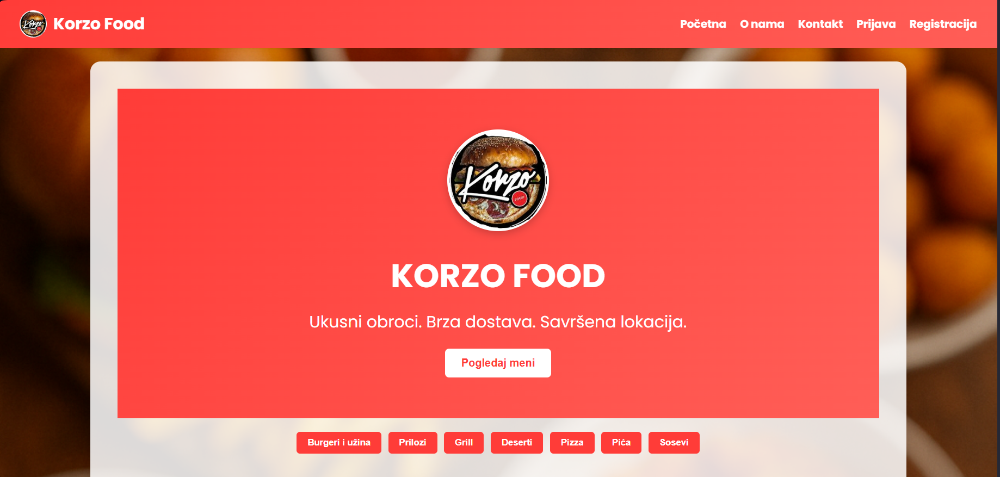

### 1.1 Početna (korisnik)


### 1.2 Početna (admin)
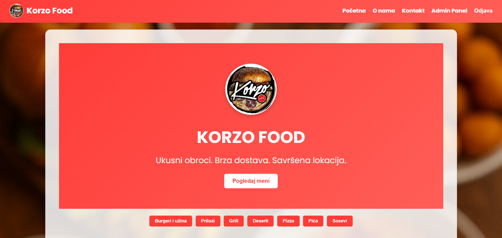

### 1.3 Mobilni prikaz
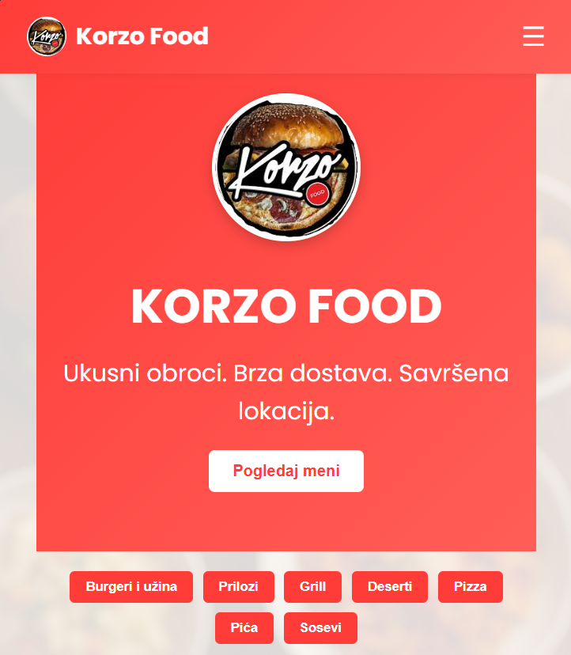

### 1.4 Mobilni prikaz (hamburger meni)
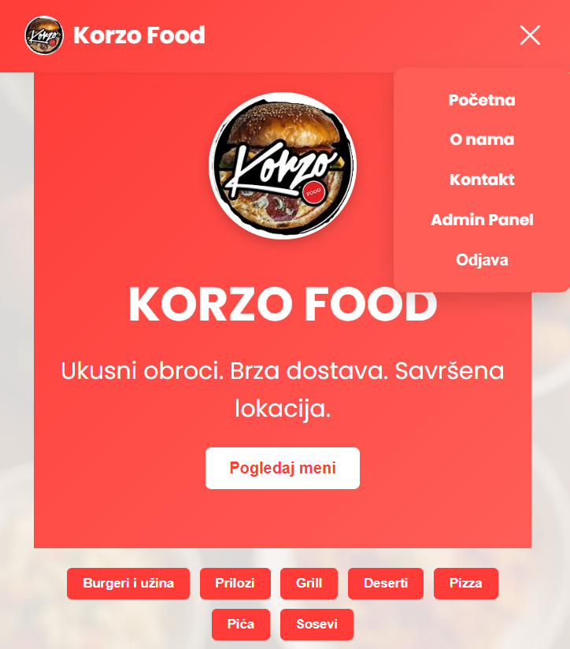

### 2. Primjer menija
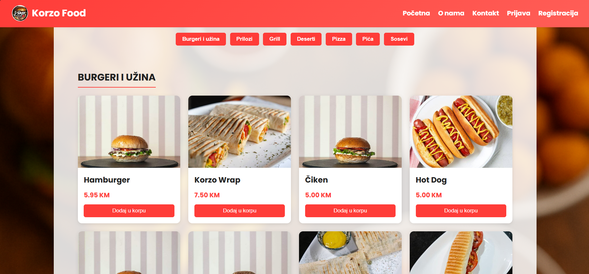

### 3. O nama
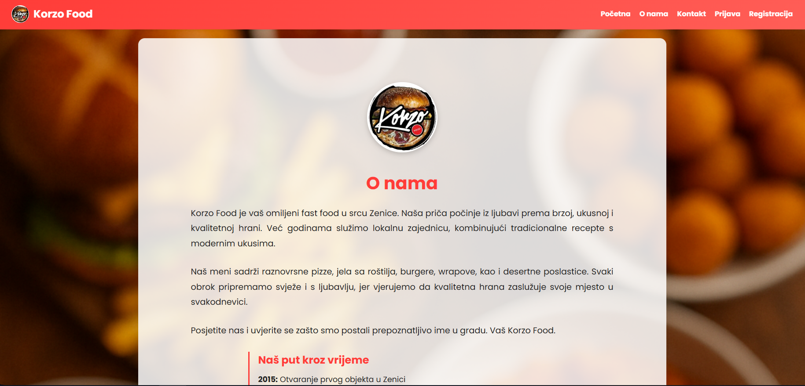

### 4. Kontakt i lokacija (korisnik)
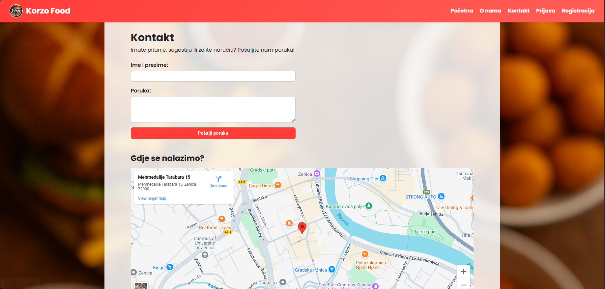

### 4.1 Kontakt (admin)
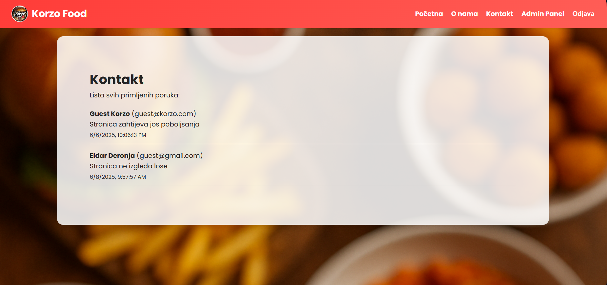

### 5. Prijava
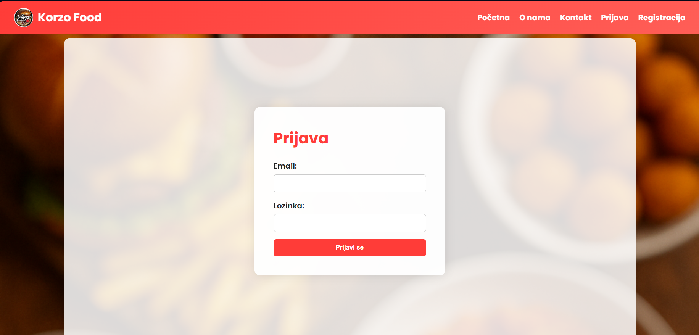

### 6. Registracija
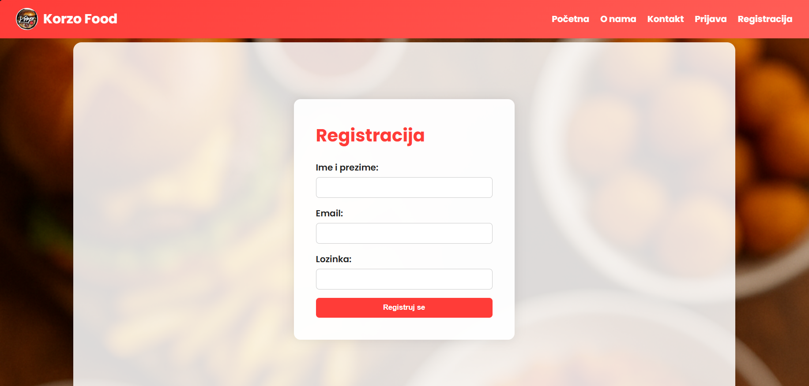

### 7. Admin panel
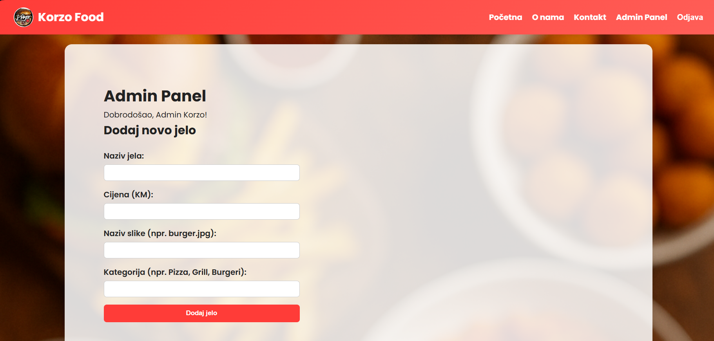
